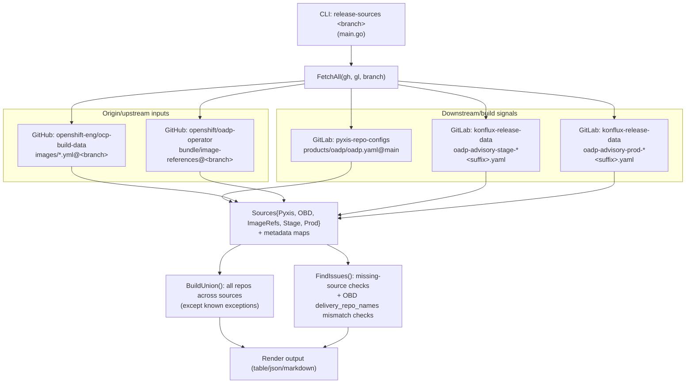
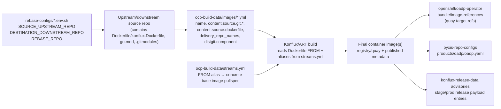
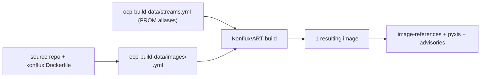
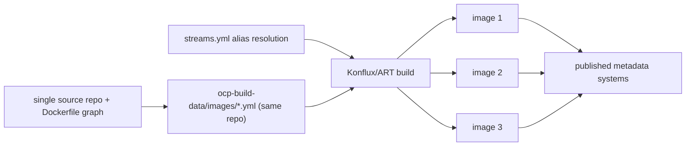

# release-sources + build provenance diagrams

## Common build provenance flow (how source metadata becomes built images)

> `release-sources` compares source-of-truth metadata across systems.  
> It **does not build images itself** and **does not parse `streams.yml` directly**.  
> The build path below shows where `ocp-build-data/streams.yml` and `konflux.Dockerfile` are used by ART/Konflux.

## Per-resulting-image diagrams (only when flow differs)

### A) Single-image repos (same/common path)

Examples: `velero`, `oadp-operator`, plugin repos, `kubevirt-datamover-controller`, `oadp-must-gather`.

### B) Multi-image repo flow (different output fan-out)

Current known multi-output case from this codebase catalog: `migtools/oadp-vm-file-restore` producing:
- `oadp-vm-file-restore`
- `oadp-vmfr-access`
- `oadp-vmfr-access-sshd`

## Where to edit for CVE remediation (quick map)

- **Upstream/downstream source-of-truth repo mapping**
  - `rebase-configs/*_<branch>.env.sh`
  - keys: `SOURCE_UPSTREAM_REPO`, `DESTINATION_DOWNSTREAM_REPO`, `REBASE_REPO`
- **Go version / builder toolchain used by Konflux build**
  - repo `konflux.Dockerfile` builder `FROM ...:rhel_9_golang_* AS builder`
  - repo `go.mod` / toolchain declarations
- **Base image aliases used in Dockerfile `FROM` replacement**
  - `openshift-eng/ocp-build-data/blob/<branch>/streams.yml`
- **Per-image build wiring and source Dockerfile path**
  - `openshift-eng/ocp-build-data/blob/<branch>/images/*.yml`
  - fields commonly used: `name`, `content.source.git.*`, `content.source.dockerfile`, `delivery_repo_names`
- **COPYs / additional files included into image**
  - source repo `Dockerfile` / `konflux.Dockerfile` (`COPY`/`ADD` statements)
- **Submodules that can introduce vulnerable content**
  - source repo `.gitmodules`
  - plus this repo’s helper hooks where applicable (e.g. `rebasebot-hook-scripts/restic-submodule-and-commit_*.sh`)
- **Where resulting image refs are published/checked**
  - `openshift/oadp-operator/bundle/image-references`
  - `releng/pyxis-repo-configs/products/oadp/oadp.yaml`
  - `releng/konflux-release-data/.../oadp-advisory-{stage,prod}-*.yaml`
