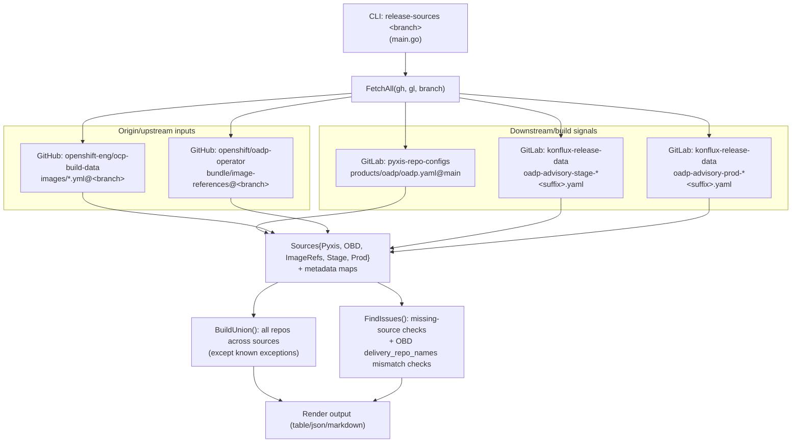
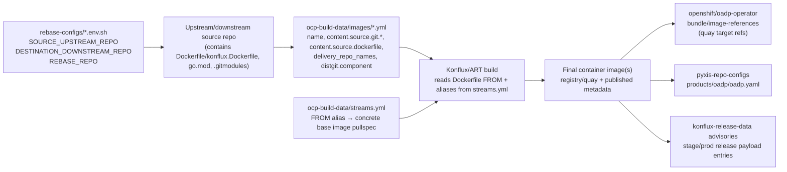
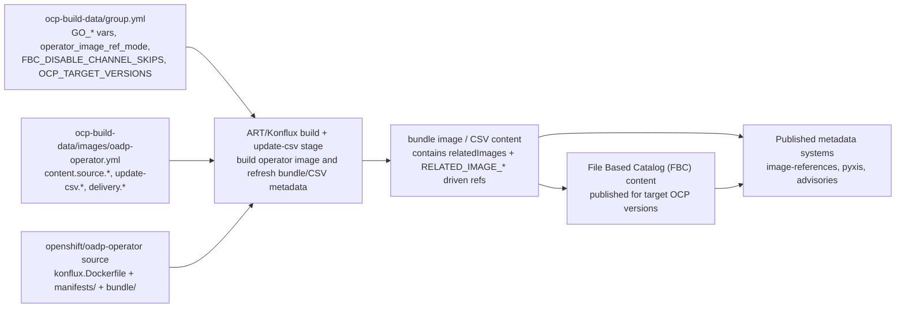
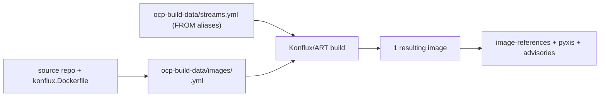
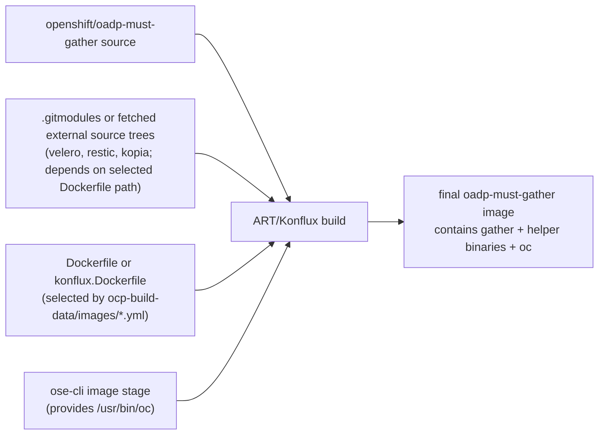
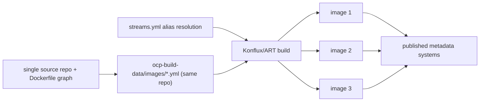

# release-sources + build provenance diagrams

## Hyperlinked reference map (step-by-step)

- Branching note: many OADP code repos use `oadp-dev` as the default development branch (not `main`), while release flows use `oadp-1.x` style branches.
- If a branch-specific link 404s: try `oadp-dev` first, then the nearest release branch (`oadp-1.6`, `oadp-1.5`, etc.).
- CLI entrypoint: [`tools/release-sources/main.go`](./main.go)
- Source collection and compare logic:
  - [`FetchAll(...)`](./sources.go)
  - [`BuildUnion(...)`](./sources.go)
  - [`FindIssues(...)`](./sources.go)
  - render paths in [`render.go`](./render.go)
- External source systems used by `FetchAll(...)`:
  - Pyxis config: [`releng/pyxis-repo-configs/products/oadp/oadp.yaml`](https://gitlab.cee.redhat.com/releng/pyxis-repo-configs/-/blob/main/products/oadp/oadp.yaml)
  - OCP build-data images: [`openshift-eng/ocp-build-data/images`](https://github.com/openshift-eng/ocp-build-data/tree/oadp-1.5/images)
  - OCP build-data streams aliases: [`openshift-eng/ocp-build-data/streams.yml`](https://github.com/openshift-eng/ocp-build-data/blob/oadp-1.5/streams.yml)
  - OADP operator image references: [`openshift/oadp-operator/bundle/image-references`](https://github.com/openshift/oadp-operator/blob/oadp-1.5/bundle/image-references)
  - Konflux advisory data:
    - advisories repo path: [`releng/konflux-release-data/advisories`](https://gitlab.cee.redhat.com/releng/konflux-release-data/-/tree/main/advisories)
    - stage files: `oadp-advisory-stage-*.yaml`
    - prod files: `oadp-advisory-prod-*.yaml`

## Common build provenance flow (how source metadata becomes built images)

> `release-sources` compares source-of-truth metadata across systems.  
> It **does not build images itself** and **does not parse `streams.yml` directly**.  
> The build path below shows where `ocp-build-data/streams.yml` and `konflux.Dockerfile` are used by ART/Konflux.

### Exactly which code uses `streams.yml` aliases/fields to resolve `FROM` base images

`release-sources` itself does **not** replace Dockerfile `FROM` lines; ART tooling does.  
Concrete code paths to inspect:

- **Image config schema says `from.stream` comes from `streams.yml`**
  - [`openshift-eng/art-tools/ocp-build-data-validator/validator/json_schemas/image_config.base.schema.json`](https://github.com/openshift-eng/art-tools/blob/25f0a8d515ef029feaaa53162cfc2011d6913d56/ocp-build-data-validator/validator/json_schemas/image_config.base.schema.json)
- **`ocp-build-data/images/*.yml` usage examples (`from.stream`, `from.builder[].stream`)**
  - [`openshift-eng/ocp-build-data/example/images/myutil-base.yml`](https://github.com/openshift-eng/ocp-build-data/blob/0a05a447bc6464f6c00a8a1948fba0b8a5953388/example/images/myutil-base.yml)
  - [`openshift-eng/ocp-build-data/example/images/template.yml`](https://github.com/openshift-eng/ocp-build-data/blob/0a05a447bc6464f6c00a8a1948fba0b8a5953388/example/images/template.yml)
- **Doozer reads `from.stream` / builder streams from image config**
  - [`openshift-eng/art-tools/doozer/doozerlib/image.py`](https://github.com/openshift-eng/art-tools/blob/25f0a8d515ef029feaaa53162cfc2011d6913d56/doozer/doozerlib/image.py)
- **Doozer rebaser resolves upstream parent images against `streams.yml` entries**
  - [`openshift-eng/art-tools/doozer/doozerlib/backend/rebaser.py`](https://github.com/openshift-eng/art-tools/blob/25f0a8d515ef029feaaa53162cfc2011d6913d56/doozer/doozerlib/backend/rebaser.py)
- **Automation that updates stream URLs/aliases**
  - [`openshift-eng/art-tools/doozer/doozerlib/backend/base_image_handler.py`](https://github.com/openshift-eng/art-tools/blob/25f0a8d515ef029feaaa53162cfc2011d6913d56/doozer/doozerlib/backend/base_image_handler.py)
  - [`openshift-eng/art-tools/pyartcd/pyartcd/pipelines/update_golang.py`](https://github.com/openshift-eng/art-tools/blob/25f0a8d515ef029feaaa53162cfc2011d6913d56/pyartcd/pyartcd/pipelines/update_golang.py)

## OADP Operator catalog path (FBC / bundle / CSV / RELATED_IMAGES)

For OADP Operator, `ocp-build-data` has additional metadata beyond plain image build wiring:
- [`openshift-eng/ocp-build-data/group.yml`](https://github.com/openshift-eng/ocp-build-data/blob/oadp-1.5/group.yml) controls shared vars and catalog behavior (for example `GO_*`, `operator_image_ref_mode`, `FBC_DISABLE_CHANNEL_SKIPS`, `OCP_TARGET_VERSIONS`).
- [`openshift-eng/ocp-build-data/images/oadp-operator.yml`](https://github.com/openshift-eng/ocp-build-data/blob/oadp-1.5/images/oadp-operator.yml) defines `update-csv` inputs plus `delivery.bundle_delivery_repo_name` / `delivery_repo_names`.
- `update-csv` processing produces/updates bundle CSV content (including [`openshift/oadp-operator/bundle/manifests/oadp-operator.clusterserviceversion.yaml`](https://github.com/openshift/oadp-operator/blob/oadp-1.5/bundle/manifests/oadp-operator.clusterserviceversion.yaml) and `RELATED_IMAGE_*` env references used by the operator deployment).
- Resulting operator/catalog payload files to inspect:
  - [`openshift/oadp-operator/bundle/image-references`](https://github.com/openshift/oadp-operator/blob/oadp-1.5/bundle/image-references)
  - [`openshift/oadp-operator/bundle/manifests/oadp-operator.clusterserviceversion.yaml`](https://github.com/openshift/oadp-operator/blob/oadp-1.5/bundle/manifests/oadp-operator.clusterserviceversion.yaml)

### `bundle/image-references`: who edits it, and who consumes it

- File location: [`openshift/oadp-operator/bundle/image-references`](https://github.com/openshift/oadp-operator/blob/oadp-1.5/bundle/image-references)
- In this tools repository, it is consumed as a **source-of-truth input** (not generated here):
  - `release-sources` fetches/parses it in [`fetchImageRefs(...)`](./sources.go)
  - `rebase-status` fetches/parses it in [`FetchImageReferences(...)`](../rebase-status/imageref.go)
  - `rebase-status` uses it to check productization and ART-name alignment in [`checkProductized(...)`](../rebase-status/checks.go) and [`crossRefImageArt(...)`](../rebase-status/checks.go)
- Practical edit model:
  - treat it as a normal git-tracked YAML manifest updated via PRs in `openshift/oadp-operator` (manual edits and/or automation-produced commits can both land as git changes),
  - `release-sources` and `rebase-status` then consume the committed file contents for consistency checks.
- Downstream coupling in `oadp-operator` tests:
  - release tests validate that `image-references` and CSV `RELATED_IMAGE_*` stay in sync:
    - [`openshift/oadp-operator/tests/release/image_references.go`](https://github.com/openshift/oadp-operator/blob/oadp-dev/tests/release/image_references.go)
    - [`openshift/oadp-operator/tests/release/image_references.go`](https://github.com/openshift/oadp-operator/blob/oadp-dev/tests/release/image_references.go)
    - file-path constants for both artifacts: [`openshift/oadp-operator/tests/release/types.go`](https://github.com/openshift/oadp-operator/blob/oadp-dev/tests/release/types.go)

## End-to-end OADP release walk-through (intern-friendly, step-by-step)

1. **Choose release branch + source repos**
   - branch-scoped mapping lives in [`rebase-configs/*_<branch>.env.sh`](../../rebase-configs/)
   - key variables: `SOURCE_UPSTREAM_REPO`, `DESTINATION_DOWNSTREAM_REPO`, `REBASE_REPO`
2. **Define build wiring for each image**
   - per-image config in [`openshift-eng/ocp-build-data/images`](https://github.com/openshift-eng/ocp-build-data/tree/oadp-1.5/images)
   - for operator specifically: [`openshift-eng/ocp-build-data/images/oadp-operator.yml`](https://github.com/openshift-eng/ocp-build-data/blob/oadp-1.5/images/oadp-operator.yml)
3. **Resolve `FROM` aliases to concrete images**
   - alias source: [`openshift-eng/ocp-build-data/streams.yml`](https://github.com/openshift-eng/ocp-build-data/blob/oadp-1.5/streams.yml)
   - consumed by ART/Konflux while processing source Dockerfiles/`konflux.Dockerfile`
4. **Build operator and component images**
   - source repos (for example [`openshift/oadp-operator`](https://github.com/openshift/oadp-operator/tree/oadp-1.5)) provide `konflux.Dockerfile`, `Dockerfile`, code, manifests, and optional submodules
   - ART/Konflux produces image artifacts destined for Quay/registry
5. **Run/update operator metadata wiring**
   - OADP operator path uses `update-csv` knobs from [`openshift-eng/ocp-build-data/images/oadp-operator.yml`](https://github.com/openshift-eng/ocp-build-data/blob/oadp-1.5/images/oadp-operator.yml)
   - CSV content (including `relatedImages` + `RELATED_IMAGE_*`) is materialized in [`openshift/oadp-operator/bundle/manifests/oadp-operator.clusterserviceversion.yaml`](https://github.com/openshift/oadp-operator/blob/oadp-1.5/bundle/manifests/oadp-operator.clusterserviceversion.yaml)
6. **Publish/maintain release image mapping**
   - productized image mapping file: [`openshift/oadp-operator/bundle/image-references`](https://github.com/openshift/oadp-operator/blob/oadp-1.5/bundle/image-references)
   - this file is what downstream checks use to determine whether an image is actively tracked for release
7. **Build/publish File-Based Catalog (FBC)**
   - catalog controls in [`openshift-eng/ocp-build-data/group.yml`](https://github.com/openshift-eng/ocp-build-data/blob/oadp-1.5/group.yml) (`OCP_TARGET_VERSIONS`, `FBC_DISABLE_CHANNEL_SKIPS`, `operator_image_ref_mode`, etc.)
   - bundle/CSV output is transformed into FBC content and published for target OCP versions
8. **Publish release visibility metadata**
   - Pyxis product config: [`releng/pyxis-repo-configs/products/oadp/oadp.yaml`](https://gitlab.cee.redhat.com/releng/pyxis-repo-configs/-/blob/main/products/oadp/oadp.yaml)
   - Konflux advisory files: [`releng/konflux-release-data/advisories`](https://gitlab.cee.redhat.com/releng/konflux-release-data/-/tree/main/advisories)
9. **Compare and audit source-of-truth systems**
   - this tool (`release-sources`) compares pyxis, ocp-build-data, image-references, and advisories:
     - [`FetchAll(...)`](./sources.go), [`BuildUnion(...)`](./sources.go), [`FindIssues(...)`](./sources.go)
10. **Gate readiness and catch drift**
   - this repo’s `rebase-status` cross-checks `image-references` vs `ocp-build-data` names and warns when entries are missing/commented:
     - [`crossRefImageArt(...)`](../rebase-status/checks.go)
     - [`checkProductized(...)`](../rebase-status/checks.go)

## Per-resulting-image diagrams (only when flow differs)

### A) Single-image repos (same/common path)

Examples: `velero`, `oadp-operator`, plugin repos, `kubevirt-datamover-controller`.

### B) `oadp-must-gather` special case (single output, multiple build sources)

`oadp-must-gather` is still one resulting image, but its build inputs are broader:
- main repo code,
- additional source trees (e.g. `velero`/`restic`/`kopia` via submodules or fetched sources depending on Dockerfile path),
- `oc` binary copied from OCP CLI image stage.

`oc`-related CVE ownership for `oadp-must-gather` is typically tied to:
- Dockerfile `FROM ...openshift-ose-cli...` stage tag/digest,
- Dockerfile `COPY --from=ose-cli /usr/bin/oc /usr/bin/oc`,
- and the `ocp-build-data/streams.yml` alias that resolves the CLI/base image pullspec used by ART.

### C) Multi-image repo flow (different output fan-out)

Current known multi-output case from this codebase catalog: `migtools/oadp-vm-file-restore` producing:
- `oadp-vm-file-restore`
- `oadp-vmfr-access`
- `oadp-vmfr-access-sshd`

## Where to edit for CVE remediation (quick map)

- **Upstream/downstream source-of-truth repo mapping**
  - [`rebase-configs/*_<branch>.env.sh`](../../rebase-configs/)
  - keys: `SOURCE_UPSTREAM_REPO`, `DESTINATION_DOWNSTREAM_REPO`, `REBASE_REPO`
- **Go version / builder toolchain used by Konflux build**
  - repo [`openshift/oadp-operator/konflux.Dockerfile`](https://github.com/openshift/oadp-operator/blob/oadp-1.5/konflux.Dockerfile) builder `FROM ...:rhel_9_golang_* AS builder`
  - repo [`openshift/oadp-operator/go.mod`](https://github.com/openshift/oadp-operator/blob/oadp-1.5/go.mod) / toolchain declarations
- **Base image aliases used in Dockerfile `FROM` replacement**
  - [`openshift-eng/ocp-build-data/streams.yml`](https://github.com/openshift-eng/ocp-build-data/blob/oadp-1.5/streams.yml)
- **Per-image build wiring and source Dockerfile path**
  - [`openshift-eng/ocp-build-data/images`](https://github.com/openshift-eng/ocp-build-data/tree/oadp-1.5/images)
  - fields commonly used: `name`, `content.source.git.*`, `content.source.dockerfile`, `delivery_repo_names`
- **Operator bundle/CSV/FBC wiring (OADP Operator path)**
  - [`openshift-eng/ocp-build-data/group.yml`](https://github.com/openshift-eng/ocp-build-data/blob/oadp-1.5/group.yml) (catalog/version knobs such as `OCP_TARGET_VERSIONS`, `FBC_DISABLE_CHANNEL_SKIPS`)
  - [`openshift-eng/ocp-build-data/images/oadp-operator.yml`](https://github.com/openshift-eng/ocp-build-data/blob/oadp-1.5/images/oadp-operator.yml) (`update-csv`, `bundle_delivery_repo_name`, `delivery_repo_names`)
  - [`openshift/oadp-operator/bundle/manifests/oadp-operator.clusterserviceversion.yaml`](https://github.com/openshift/oadp-operator/blob/oadp-1.5/bundle/manifests/oadp-operator.clusterserviceversion.yaml) (`relatedImages`, `RELATED_IMAGE_*` env usage)
- **COPYs / additional files included into image**
  - source repo [`openshift/oadp-operator`](https://github.com/openshift/oadp-operator/tree/oadp-1.5) (`COPY`/`ADD` statements)
- **Submodules that can introduce vulnerable content**
  - source repo [`openshift/oadp-must-gather/.gitmodules`](https://github.com/openshift/oadp-must-gather/blob/oadp-1.5/.gitmodules)
  - plus this repo’s helper hooks where applicable (e.g. [`rebasebot-hook-scripts/restic-submodule-and-commit_*.sh`](../../rebasebot-hook-scripts/))
- **Where resulting image refs are published/checked**
  - [`openshift/oadp-operator/bundle/image-references`](https://github.com/openshift/oadp-operator/blob/oadp-1.5/bundle/image-references)
  - [`releng/pyxis-repo-configs/products/oadp/oadp.yaml`](https://gitlab.cee.redhat.com/releng/pyxis-repo-configs/-/blob/main/products/oadp/oadp.yaml)
  - [`releng/konflux-release-data/advisories`](https://gitlab.cee.redhat.com/releng/konflux-release-data/-/tree/main/advisories)
