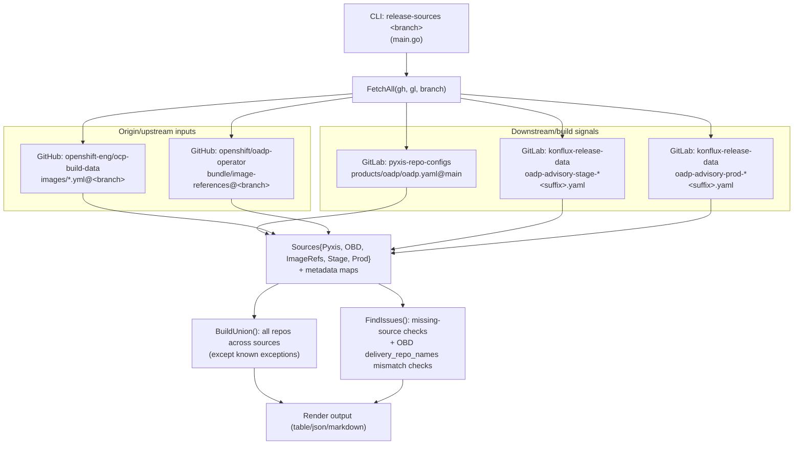
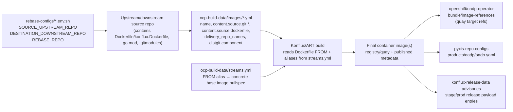
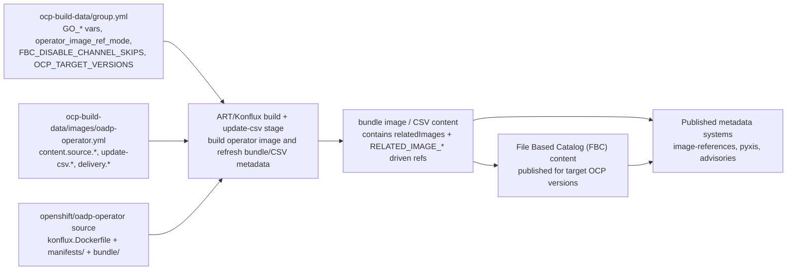
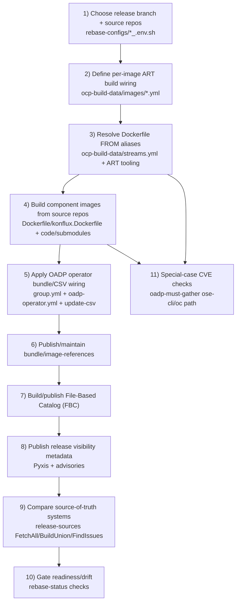
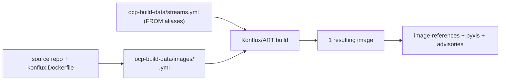
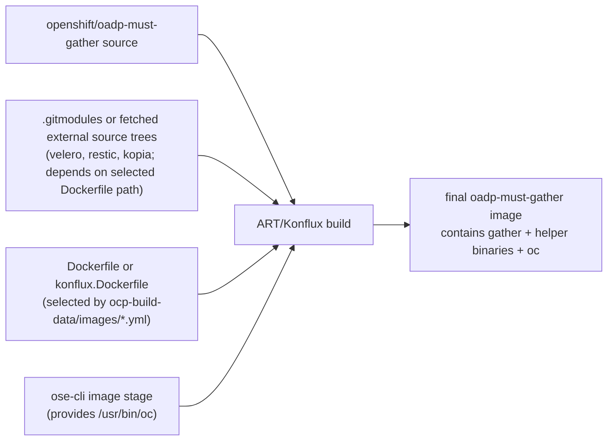
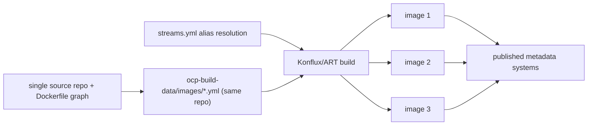

# release-sources + build provenance diagrams

## Hyperlinked reference map (step-by-step)

- Branching note: many OADP code repos use `oadp-dev` as the default development branch (not `main`), while release flows use `oadp-1.x` style branches.
- If a branch-specific link 404s: try `oadp-dev` first, then the nearest release branch (`oadp-1.6`, `oadp-1.5`, etc.).
- CLI entrypoint: [`tools/release-sources/main.go`](./main.go)
- Source collection and compare logic:
  - [`FetchAll(...)`](./sources.go)
  - [`BuildUnion(...)`](./sources.go)
  - [`FindIssues(...)`](./sources.go)
  - render paths in [`render.go`](./render.go)
- External source systems used by `FetchAll(...)`:
  - Pyxis config: [`releng/pyxis-repo-configs/products/oadp/oadp.yaml`](https://gitlab.cee.redhat.com/releng/pyxis-repo-configs/-/blob/main/products/oadp/oadp.yaml)
  - OCP build-data images: [`openshift-eng/ocp-build-data/images`](https://github.com/openshift-eng/ocp-build-data/tree/oadp-1.5/images)
  - OCP build-data streams aliases: [`openshift-eng/ocp-build-data/streams.yml`](https://github.com/openshift-eng/ocp-build-data/blob/oadp-1.5/streams.yml)
  - OADP operator image references: [`openshift/oadp-operator/bundle/image-references`](https://github.com/openshift/oadp-operator/blob/oadp-1.5/bundle/image-references)
  - Konflux advisory data:
    - advisories repo path: [`releng/konflux-release-data/advisories`](https://gitlab.cee.redhat.com/releng/konflux-release-data/-/tree/main/advisories)
    - stage files: `oadp-advisory-stage-*.yaml`
    - prod files: `oadp-advisory-prod-*.yaml`

## Common build provenance flow (how source metadata becomes built images)

> `release-sources` compares source-of-truth metadata across systems.  
> It **does not build images itself** and **does not parse `streams.yml` directly**.  
> The build path below shows where `ocp-build-data/streams.yml` and `konflux.Dockerfile` are used by ART/Konflux.

## OADP Operator catalog path (FBC / bundle / CSV / RELATED_IMAGES)

Most step-by-step details for this flow (vars/files/envs/repos and exact code links) are consolidated in the walkthrough section below.

## End-to-end OADP release walk-through (intern-friendly, step-by-step)

1. **Choose release branch + source repos**
   - branch-scoped mapping lives in [`rebase-configs/*_<branch>.env.sh`](../../rebase-configs/)
   - key variables: `SOURCE_UPSTREAM_REPO`, `DESTINATION_DOWNSTREAM_REPO`, `REBASE_REPO`
2. **Define per-image ART build wiring**
   - per-image config in [`openshift-eng/ocp-build-data/images`](https://github.com/openshift-eng/ocp-build-data/tree/oadp-1.5/images)
   - for operator specifically: [`openshift-eng/ocp-build-data/images/oadp-operator.yml`](https://github.com/openshift-eng/ocp-build-data/blob/oadp-1.5/images/oadp-operator.yml)
   - common fields to inspect/edit: `name`, `content.source.git.*`, `content.source.dockerfile`, `delivery_repo_names`, `update-csv.*`
3. **Resolve Dockerfile `FROM` aliases to concrete pullspecs**
   - alias source: [`openshift-eng/ocp-build-data/streams.yml`](https://github.com/openshift-eng/ocp-build-data/blob/oadp-1.5/streams.yml)
   - schema and examples for `from.stream` / builder streams:
     - [`openshift-eng/art-tools/ocp-build-data-validator/validator/json_schemas/image_config.base.schema.json`](https://github.com/openshift-eng/art-tools/blob/25f0a8d515ef029feaaa53162cfc2011d6913d56/ocp-build-data-validator/validator/json_schemas/image_config.base.schema.json)
     - [`openshift-eng/ocp-build-data/example/images/myutil-base.yml`](https://github.com/openshift-eng/ocp-build-data/blob/0a05a447bc6464f6c00a8a1948fba0b8a5953388/example/images/myutil-base.yml)
     - [`openshift-eng/ocp-build-data/example/images/template.yml`](https://github.com/openshift-eng/ocp-build-data/blob/0a05a447bc6464f6c00a8a1948fba0b8a5953388/example/images/template.yml)
   - ART tooling paths that read/resolve stream aliases:
     - [`openshift-eng/art-tools/doozer/doozerlib/image.py`](https://github.com/openshift-eng/art-tools/blob/25f0a8d515ef029feaaa53162cfc2011d6913d56/doozer/doozerlib/image.py)
     - [`openshift-eng/art-tools/doozer/doozerlib/backend/rebaser.py`](https://github.com/openshift-eng/art-tools/blob/25f0a8d515ef029feaaa53162cfc2011d6913d56/doozer/doozerlib/backend/rebaser.py)
     - [`openshift-eng/art-tools/doozer/doozerlib/backend/base_image_handler.py`](https://github.com/openshift-eng/art-tools/blob/25f0a8d515ef029feaaa53162cfc2011d6913d56/doozer/doozerlib/backend/base_image_handler.py)
     - [`openshift-eng/art-tools/pyartcd/pyartcd/pipelines/update_golang.py`](https://github.com/openshift-eng/art-tools/blob/25f0a8d515ef029feaaa53162cfc2011d6913d56/pyartcd/pyartcd/pipelines/update_golang.py)
4. **Build component images from source repos**
   - source repos (for example [`openshift/oadp-operator`](https://github.com/openshift/oadp-operator/tree/oadp-1.5)) provide `konflux.Dockerfile`, `Dockerfile`, code, manifests, and optional submodules
   - CVE-impacting edit points commonly include:
     - builder/runtime base-image `FROM` lines in [`openshift/oadp-operator/konflux.Dockerfile`](https://github.com/openshift/oadp-operator/blob/oadp-1.5/konflux.Dockerfile)
     - toolchain declarations in [`openshift/oadp-operator/go.mod`](https://github.com/openshift/oadp-operator/blob/oadp-1.5/go.mod)
     - copied content via `COPY`/`ADD` in [`openshift/oadp-operator`](https://github.com/openshift/oadp-operator/tree/oadp-1.5)
     - submodule inputs in [`openshift/oadp-must-gather/.gitmodules`](https://github.com/openshift/oadp-must-gather/blob/oadp-1.5/.gitmodules)
     - helper hooks in this repo (for example [`rebasebot-hook-scripts/restic-submodule-and-commit_*.sh`](../../rebasebot-hook-scripts/))
5. **Apply OADP Operator bundle/CSV wiring**
   - catalog/version/env controls in [`openshift-eng/ocp-build-data/group.yml`](https://github.com/openshift-eng/ocp-build-data/blob/oadp-1.5/group.yml) (for example `GO_*`, `operator_image_ref_mode`, `FBC_DISABLE_CHANNEL_SKIPS`, `OCP_TARGET_VERSIONS`)
   - operator image + `update-csv` knobs in [`openshift-eng/ocp-build-data/images/oadp-operator.yml`](https://github.com/openshift-eng/ocp-build-data/blob/oadp-1.5/images/oadp-operator.yml)
   - resulting CSV wiring in [`openshift/oadp-operator/bundle/manifests/oadp-operator.clusterserviceversion.yaml`](https://github.com/openshift/oadp-operator/blob/oadp-1.5/bundle/manifests/oadp-operator.clusterserviceversion.yaml) (`relatedImages`, `RELATED_IMAGE_*`)
6. **Publish/maintain `bundle/image-references` as release mapping**
   - file path: [`openshift/oadp-operator/bundle/image-references`](https://github.com/openshift/oadp-operator/blob/oadp-1.5/bundle/image-references)
   - treated as git-tracked source-of-truth in `openshift/oadp-operator` PRs (manual and automation updates both land as commits)
   - downstream coupling tests:
     - [`openshift/oadp-operator/tests/release/image_references.go`](https://github.com/openshift/oadp-operator/blob/oadp-dev/tests/release/image_references.go)
     - [`openshift/oadp-operator/tests/release/types.go`](https://github.com/openshift/oadp-operator/blob/oadp-dev/tests/release/types.go)
7. **Build/publish File-Based Catalog (FBC)**
   - ART/Konflux + `update-csv` output produce bundle/CSV inputs consumed by FBC publish flows for target OCP versions
8. **Publish release visibility metadata**
   - Pyxis product config: [`releng/pyxis-repo-configs/products/oadp/oadp.yaml`](https://gitlab.cee.redhat.com/releng/pyxis-repo-configs/-/blob/main/products/oadp/oadp.yaml)
   - Konflux advisory files: [`releng/konflux-release-data/advisories`](https://gitlab.cee.redhat.com/releng/konflux-release-data/-/tree/main/advisories)
9. **Compare source-of-truth systems in `release-sources`**
   - parse/fetch paths in [`FetchAll(...)`](./sources.go)
   - comparison paths in [`BuildUnion(...)`](./sources.go), [`FindIssues(...)`](./sources.go)
10. **Gate readiness/drift in `rebase-status`**
    - parse image-references in [`FetchImageReferences(...)`](../rebase-status/imageref.go)
    - cross-checks in [`crossRefImageArt(...)`](../rebase-status/checks.go), [`checkProductized(...)`](../rebase-status/checks.go)
11. **Special-case CVE checks for `oadp-must-gather`**
    - verify CLI image stage source in Dockerfile `FROM ...openshift-ose-cli...`
    - verify `COPY --from=ose-cli /usr/bin/oc /usr/bin/oc`
    - verify the matching `streams.yml` alias resolves to expected CLI/base pullspec

## Per-resulting-image diagrams (only when flow differs)

### A) Single-image repos (same/common path)

Examples: `velero`, `oadp-operator`, plugin repos, `kubevirt-datamover-controller`.

### B) `oadp-must-gather` special case (single output, multiple build sources)

Detailed ownership/edit notes for this case are in walkthrough step **11**.

### C) Multi-image repo flow (different output fan-out)

Current known multi-output case from this codebase catalog: `migtools/oadp-vm-file-restore`.

## Where to edit for CVE remediation (quick map)

- Primary edit/debug map is now consolidated in the walkthrough:
  - branch/repo/env inputs: steps **1-2**
  - base-image alias/debug paths (`streams.yml`, doozer, pyartcd): step **3**
  - Dockerfile, toolchain, COPY/ADD, submodule edit points: steps **4** and **11**
  - operator CSV/bundle/FBC controls: steps **5-7**
  - release publication and drift checks: steps **8-10**
