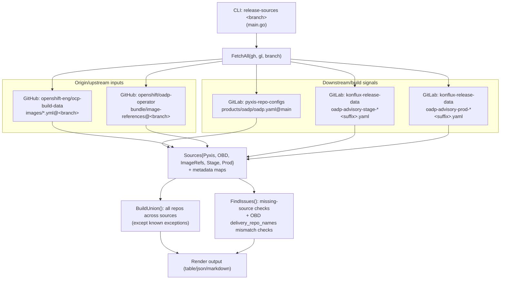
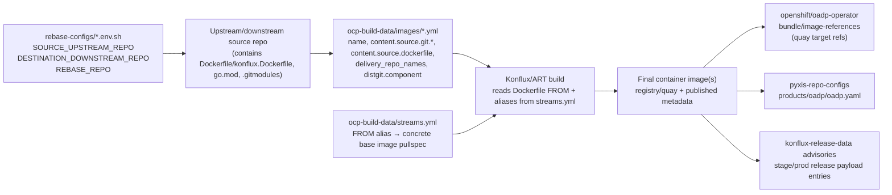
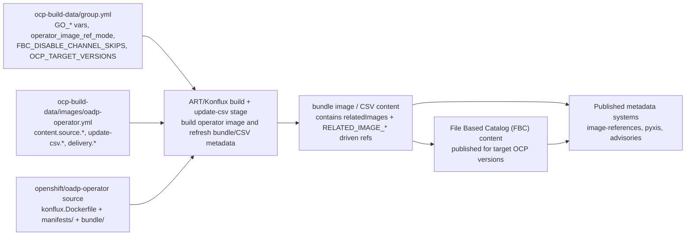
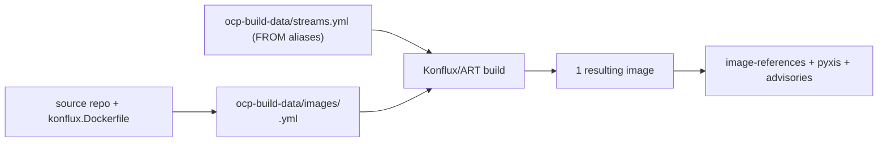
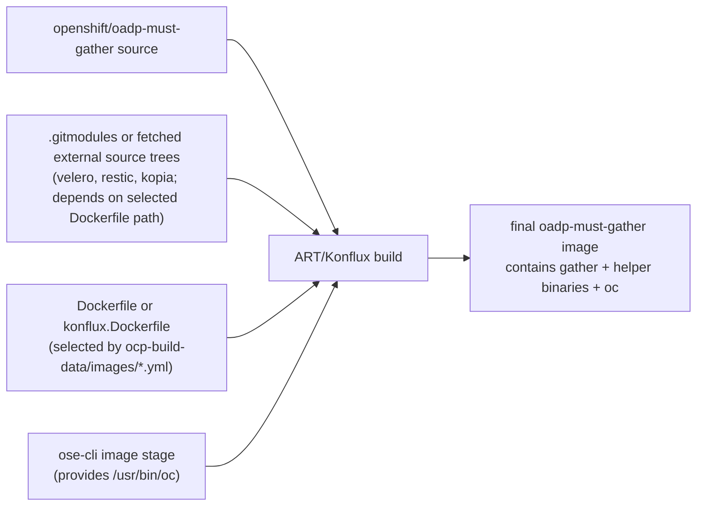
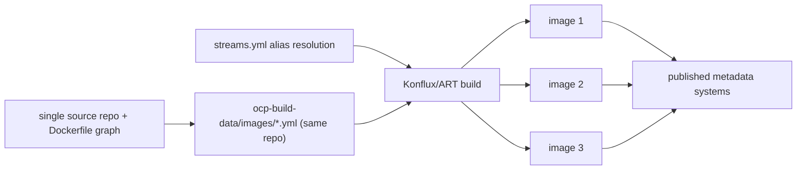

# release-sources + build provenance diagrams

## Hyperlinked reference map (step-by-step)

- CLI entrypoint: [`tools/release-sources/main.go`](./main.go)
- Source collection and compare logic:
  - [`FetchAll(...)`](./sources.go)
  - [`BuildUnion(...)`](./sources.go)
  - [`FindIssues(...)`](./sources.go)
  - render paths in [`render.go`](./render.go)
- External source systems used by `FetchAll(...)`:
  - Pyxis config: [`releng/pyxis-repo-configs/products/oadp/oadp.yaml`](https://gitlab.cee.redhat.com/releng/pyxis-repo-configs/-/blob/main/products/oadp/oadp.yaml)
  - OCP build-data images: [`openshift-eng/ocp-build-data/images/*.yml` (oadp-1.5)](https://github.com/openshift-eng/ocp-build-data/tree/oadp-1.5/images)
  - OCP build-data streams aliases: [`openshift-eng/ocp-build-data/streams.yml` (oadp-1.5)](https://github.com/openshift-eng/ocp-build-data/blob/oadp-1.5/streams.yml)
  - OADP operator image references: [`openshift/oadp-operator/bundle/image-references` (oadp-1.5)](https://github.com/openshift/oadp-operator/blob/oadp-1.5/bundle/image-references)
  - Konflux advisory data:
    - advisories repo path: [`releng/konflux-release-data/advisories`](https://gitlab.cee.redhat.com/releng/konflux-release-data/-/tree/main/advisories)
    - stage files: `oadp-advisory-stage-*.yaml`
    - prod files: `oadp-advisory-prod-*.yaml`

## Common build provenance flow (how source metadata becomes built images)

> `release-sources` compares source-of-truth metadata across systems.  
> It **does not build images itself** and **does not parse `streams.yml` directly**.  
> The build path below shows where `ocp-build-data/streams.yml` and `konflux.Dockerfile` are used by ART/Konflux.

## OADP Operator catalog path (FBC / bundle / CSV / RELATED_IMAGES)

For OADP Operator, `ocp-build-data` has additional metadata beyond plain image build wiring:
- [`group.yml` (oadp-1.5)](https://github.com/openshift-eng/ocp-build-data/blob/oadp-1.5/group.yml) controls shared vars and catalog behavior (for example `GO_*`, `operator_image_ref_mode`, `FBC_DISABLE_CHANNEL_SKIPS`, `OCP_TARGET_VERSIONS`).
- [`images/oadp-operator.yml` (oadp-1.5)](https://github.com/openshift-eng/ocp-build-data/blob/oadp-1.5/images/oadp-operator.yml) defines `update-csv` inputs plus `delivery.bundle_delivery_repo_name` / `delivery_repo_names`.
- `update-csv` processing produces/updates bundle CSV content (including [`relatedImages` in CSV](https://github.com/openshift/oadp-operator/blob/oadp-1.5/bundle/manifests/oadp-operator.clusterserviceversion.yaml) and `RELATED_IMAGE_*` env references used by the operator deployment).
- Resulting operator/catalog payload files to inspect:
  - [`bundle/image-references` (oadp-1.5)](https://github.com/openshift/oadp-operator/blob/oadp-1.5/bundle/image-references)
  - [`bundle/manifests/oadp-operator.clusterserviceversion.yaml` (oadp-1.5)](https://github.com/openshift/oadp-operator/blob/oadp-1.5/bundle/manifests/oadp-operator.clusterserviceversion.yaml)

## Per-resulting-image diagrams (only when flow differs)

### A) Single-image repos (same/common path)

Examples: `velero`, `oadp-operator`, plugin repos, `kubevirt-datamover-controller`.

### B) `oadp-must-gather` special case (single output, multiple build sources)

`oadp-must-gather` is still one resulting image, but its build inputs are broader:
- main repo code,
- additional source trees (e.g. `velero`/`restic`/`kopia` via submodules or fetched sources depending on Dockerfile path),
- `oc` binary copied from OCP CLI image stage.

`oc`-related CVE ownership for `oadp-must-gather` is typically tied to:
- Dockerfile `FROM ...openshift-ose-cli...` stage tag/digest,
- Dockerfile `COPY --from=ose-cli /usr/bin/oc /usr/bin/oc`,
- and the `ocp-build-data/streams.yml` alias that resolves the CLI/base image pullspec used by ART.

### C) Multi-image repo flow (different output fan-out)

Current known multi-output case from this codebase catalog: `migtools/oadp-vm-file-restore` producing:
- `oadp-vm-file-restore`
- `oadp-vmfr-access`
- `oadp-vmfr-access-sshd`

## Where to edit for CVE remediation (quick map)

- **Upstream/downstream source-of-truth repo mapping**
  - [`rebase-configs/*_<branch>.env.sh`](../../rebase-configs/)
  - keys: `SOURCE_UPSTREAM_REPO`, `DESTINATION_DOWNSTREAM_REPO`, `REBASE_REPO`
- **Go version / builder toolchain used by Konflux build**
  - repo [`konflux.Dockerfile`](https://github.com/openshift/oadp-operator/blob/oadp-1.5/konflux.Dockerfile) builder `FROM ...:rhel_9_golang_* AS builder`
  - repo [`go.mod`](https://github.com/openshift/oadp-operator/blob/oadp-1.5/go.mod) / toolchain declarations
- **Base image aliases used in Dockerfile `FROM` replacement**
  - [`openshift-eng/ocp-build-data/streams.yml`](https://github.com/openshift-eng/ocp-build-data/blob/oadp-1.5/streams.yml)
- **Per-image build wiring and source Dockerfile path**
  - [`openshift-eng/ocp-build-data/images/*.yml`](https://github.com/openshift-eng/ocp-build-data/tree/oadp-1.5/images)
  - fields commonly used: `name`, `content.source.git.*`, `content.source.dockerfile`, `delivery_repo_names`
- **Operator bundle/CSV/FBC wiring (OADP Operator path)**
  - [`ocp-build-data/group.yml`](https://github.com/openshift-eng/ocp-build-data/blob/oadp-1.5/group.yml) (catalog/version knobs such as `OCP_TARGET_VERSIONS`, `FBC_DISABLE_CHANNEL_SKIPS`)
  - [`ocp-build-data/images/oadp-operator.yml`](https://github.com/openshift-eng/ocp-build-data/blob/oadp-1.5/images/oadp-operator.yml) (`update-csv`, `bundle_delivery_repo_name`, `delivery_repo_names`)
  - [`oadp-operator CSV`](https://github.com/openshift/oadp-operator/blob/oadp-1.5/bundle/manifests/oadp-operator.clusterserviceversion.yaml) (`relatedImages`, `RELATED_IMAGE_*` env usage)
- **COPYs / additional files included into image**
  - source repo [`Dockerfile` / `konflux.Dockerfile`](https://github.com/openshift/oadp-operator/tree/oadp-1.5) (`COPY`/`ADD` statements)
- **Submodules that can introduce vulnerable content**
  - source repo [`.gitmodules`](https://github.com/openshift/oadp-must-gather/blob/oadp-1.5/.gitmodules)
  - plus this repo’s helper hooks where applicable (e.g. [`rebasebot-hook-scripts/restic-submodule-and-commit_*.sh`](../../rebasebot-hook-scripts/))
- **Where resulting image refs are published/checked**
  - [`openshift/oadp-operator/bundle/image-references`](https://github.com/openshift/oadp-operator/blob/oadp-1.5/bundle/image-references)
  - [`releng/pyxis-repo-configs/products/oadp/oadp.yaml`](https://gitlab.cee.redhat.com/releng/pyxis-repo-configs/-/blob/main/products/oadp/oadp.yaml)
  - [`releng/konflux-release-data` advisory files](https://gitlab.cee.redhat.com/releng/konflux-release-data/-/tree/main/advisories)
