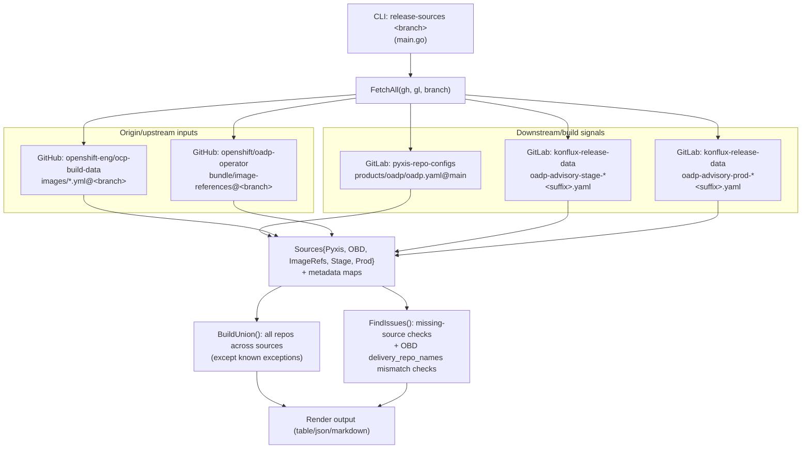

# release-sources flow diagram

```mermaid
flowchart TD
    A["CLI: release-sources &lt;branch&gt;<br/>(main.go)"] --> B["FetchAll(gh, gl, branch)"]

    B --> C1["GitLab: pyxis-repo-configs<br/>products/oadp/oadp.yaml@main"]
    B --> C2["GitHub: openshift-eng/ocp-build-data<br/>images/*.yml@&lt;branch&gt;"]
    B --> C3["GitHub: openshift/oadp-operator<br/>bundle/image-references@&lt;branch&gt;"]
    B --> C4["GitLab: konflux-release-data<br/>oadp-advisory-stage-*&lt;suffix&gt;.yaml"]
    B --> C5["GitLab: konflux-release-data<br/>oadp-advisory-prod-*&lt;suffix&gt;.yaml"]

    C1 --> D["Sources{Pyxis, OBD, ImageRefs, Stage, Prod}<br/>+ metadata maps"]
    C2 --> D
    C3 --> D
    C4 --> D
    C5 --> D

    D --> E["BuildUnion(): all repos across sources<br/>(except known exceptions)"]
    D --> F["FindIssues(): missing-source checks<br/>+ OBD delivery_repo_names mismatch checks"]
    E --> G["Render output (table/json/markdown)"]
    F --> G

    subgraph Upstream_inputs["Origin/upstream inputs"]
      C2
      C3
    end

    subgraph Downstream_build_targets["Downstream/build signals"]
      C1
      C4
      C5
    end
```
